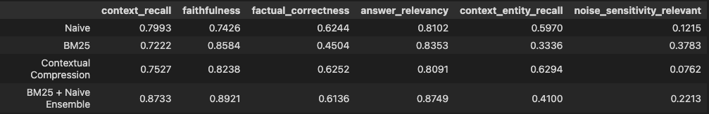

<h1>Certification Challenge Deliverables</h1>

<h2>Task 1: Defining your Problem and Audience</h2>

1. Save time spent searching the web to obtain, validate, and synthesize product information for the purpose of grocery retail integration.

2. This is a problem for the user because often time the forms submitted by retailers to request product integration are often inaccurate or incomplete with respect to the necessary information needed to correctly integrate the product for store sales. This requires the user to have to manually validate the information, search the web for missing information, and synthesize findings in order to complete the integration.

    In an example the user expressed a single product requiring 5 days and the capacity of multiple team members to identify all of the required information. This tool will help the user by simplifying the product query, automating the validation step, as well as retrieveing robust information from local and/or web trusted sources.

<h2>Task 2: Propose a Solution</h2>

1. As a proposed solution I present the Simple Autonomous Verification Engine, or S.A.V.E. . The application consists of an agentic system that will assist the user by saving time validating, obtaining, and compiling product information. The user will submit a prompt in the form of a question or a structured object containing a product UPC (universal product code), description, or both. If unstructured the system will extract this information from the query and validate it before attempting a search. The system also has a pre-defined set of streps to attempt to standardized incorrect UPCs as this was noted as a common occurrence by the user. 

    The application will look and feel like interacting with a chatbot assistant that is knowledgeable, with respect to pre-defined product code standards and data sources, on the information needed to complete product integration.

2. Tools used in the application stack:
  - LLM: Main agent = claude-sonnet-4. Chat = gpt-4.1-mini. RAG = gpt-4.1-nano. Using small cheap model where applicable. More powerful reasoning model where required
  - Embedding Model: I used open AIs text embedding 3 because it seemed sufficient for the RAG data I generated.
  -	Orchestration: Lang graph. I am familiar with graphs, and it’s a good framework.
  -	Vector Database: Quadrant. What was taught in the course. Works for use case.
  -	Monitoring: I did not include monitoring in the app (not in rubric) but in production I will use langsmith to match langgraph and stay within the lang ecosystem.
  - Evaluation: RAGAS. Works well for RAG pipelines and has complete synthetic data generation and evaluation suite. 
  - User Interface: Vide coded front end. Fast API back end. Learned in course and works.

3. Agents will be used in the rag tool as well as the main graph architecture. Agentic reasoning will be used in the main graph to determine when and what tool to use as well as when to return a response to the user.

<h2>Task 3: Dealing with the Data</h2>

1. The data sources and their uses are the following:

	- Openfoodfacts documents: Created documents from API calls for the purpose of RAG. Used as knowledge base. 
	- USDA API: USDA nutritional database. Used to validate UPCs as well as obtain robust product information.
	- Web search: Used to locate supplementary product information. 

2. 	I will be using recursive text splitting chunking. It fits the files I created for RAG.

<h2>Task 4: Building a Quick End-to-End Agentic RAG Prototype</h2>

1. App in repo.

<h2>Task 5: Creating a Golden Test Data Set</h2>

1. In Ragas_Evaluation.ipynb

2. It works decently based on metrics and observed testing of the app.

<h2>Task 6: The Benefits of Advanced Retrieval</h2>

1. I will be testing the naive RAG and I will also be testing an ensemble retriever that will consist of equally weighted results from a bm25 retriever and a naive retriever. For my the simple data I created the naive should do fine, but I alos added bm25 for exact matching since we will be extracting UPC and product description before checking the knowledge base.

2. In Ragas_Evaluation.ipynb

<h2>Task 7: Assessing Performance</h2>

1. The ensemble retriever had higher scores than all of the other retrievers on 3 out of 6 of the metrics. Most importantly faithfulness, but there was also a sigificant gap in context recall performance which coincided with the added benefit of exact matching in my use case.

2. There are several changes to the app that I plan to make before demo day but a few are the following:
	- Checking local database for products UPC matches. This will let the user save time by verifying if we already have the product integrated.
	- Web image retrieval. Images were noted by the user as particularly important in searching.
	- GTIN code support. The app only supports UPC-12 format now.
	- Conversation context saving. The app now does not have a working memory.

<h2>Loom Video Link</h2>
https://www.loom.com/share/a6bdac9493c342918f0369efaed1557e?sid=f7576cb0-841b-4ef1-9299-4174e69f3524